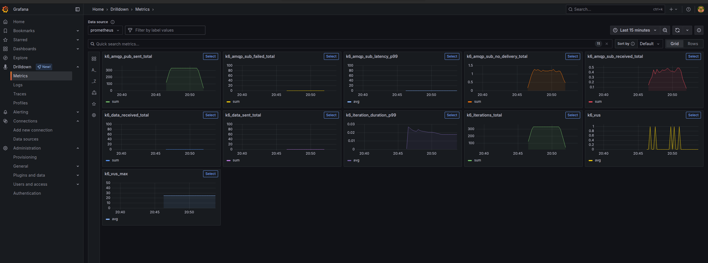
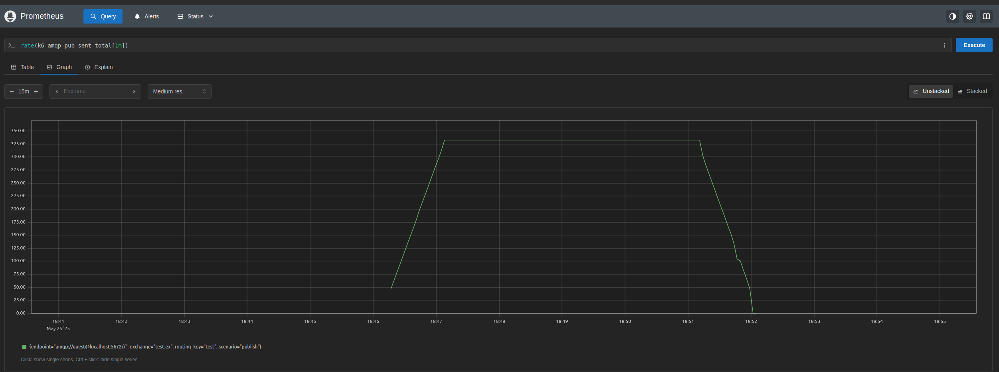
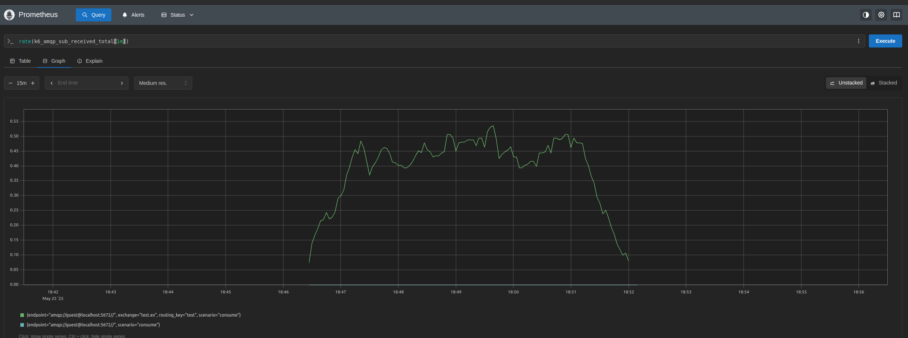

# K6 K9-AMQP extension prometheus remote write

## Summary

K6 allows to write K6 metrics using (prometheus-remote-write)[https://grafana.com/docs/k6/latest/results-output/real-time/prometheus-remote-write/#prometheus-remote-write] experimental module.


## Run Prometheus and Grafana

Use your Prometheus and Grafana or run locally.

### Create prometheus.yaml (empty file)


```yaml

```

### Create empty `data` directory


```bash
mkdir data

```

### Create docker-compose.yaml

```yaml
networks:
  prometheus:
    driver: bridge

services:
  grafana:
    container_name: grafana
    image: grafana/grafana:12.0.0
    hostname: grafana
    ports:
      - "3000:3000"
    networks:
      - prometheus
  prometheus:
    container_name: prometheus
    image: prom/prometheus:v3.3.1
    hostname: prometheus
    ports:
      - "9090:9090"
    networks:
      - prometheus
    volumes:
      - type: bind
        source: ./prometheus.yaml
        target: /prometheus/prometheus.yaml
      - type: bind
        source: ./data/prometheus
        target: /test
    command: "--config.file=prometheus.yaml --storage.tsdb.retention.time=60d --web.enable-remote-write-receiver"
  rabbitmq:
    container_name: rabbitmq
    image: rabbitmq:4.1.0-management
    hostname: rabbitmq
    ports:
      - "5672:5672"
      - "15672:15672"
    networks:
      - rabbitmq

```

### Run Grafana and Prometheus


```bash
sudo docker compose up

[+] Running 5/5
 ✔ Network prometheus_prometheus  Created                                                                                                                                                               0.1s 
 ✔ Network prometheus_rabbitmq    Created                                                                                                                                                               0.1s 
 ✔ Container grafana              Created                                                                                                                                                               0.2s 
 ✔ Container prometheus           Created                                                                                                                                                               0.2s 
 ✔ Container rabbitmq             Created                                                                                                                                                               0.2s 
Attaching to grafana, prometheus, rabbitmq
prometheus  | time=2025-05-25T16:28:15.632Z level=INFO source=main.go:1487 msg="updated GOGC" old=100 new=75
prometheus  | time=2025-05-25T16:28:15.633Z level=INFO source=main.go:625 msg="Leaving GOMAXPROCS=8: CPU quota undefined" component=automaxprocs
prometheus  | time=2025-05-25T16:28:15.633Z level=INFO source=main.go:713 msg="Starting Prometheus Server" mode=server version="(version=3.3.1, branch=HEAD, revision=3dcecabff6f52cc155290cb723706f4c324ed0ab)"
prometheus  | time=2025-05-25T16:28:15.633Z level=INFO source=main.go:718 msg="operational information" build_context="(go=go1.24.2, platform=linux/amd64, user=root@f0d295ca0db2, date=20250502-15:03:21, tags=netgo,builtinassets,stringlabels)" host_details="(Linux 6.14.0-15-generic #15-Ubuntu SMP PREEMPT_DYNAMIC Sun Apr  6 15:05:05 UTC 2025 x86_64 prometheus (none))" fd_limits="(soft=1073741816, hard=1073741816)" vm_limits="(soft=unlimited, hard=unlimited)"
prometheus  | time=2025-05-25T16:28:15.638Z level=INFO source=web.go:654 msg="Start listening for connections" component=web address=0.0.0.0:9090
prometheus  | time=2025-05-25T16:28:15.639Z level=INFO source=main.go:1231 msg="Starting TSDB ..."
prometheus  | time=2025-05-25T16:28:15.643Z level=INFO source=tls_config.go:347 msg="Listening on" component=web address=[::]:9090
prometheus  | time=2025-05-25T16:28:15.643Z level=INFO source=tls_config.go:350 msg="TLS is disabled." component=web http2=false address=[::]:9090
prometheus  | time=2025-05-25T16:28:15.651Z level=INFO source=head.go:638 msg="Replaying on-disk memory mappable chunks if any" component=tsdb
prometheus  | time=2025-05-25T16:28:15.651Z level=INFO source=head.go:725 msg="On-disk memory mappable chunks replay completed" component=tsdb duration=7.506µs
prometheus  | time=2025-05-25T16:28:15.651Z level=INFO source=head.go:733 msg="Replaying WAL, this may take a while" component=tsdb
prometheus  | time=2025-05-25T16:28:15.652Z level=INFO source=head.go:805 msg="WAL segment loaded" component=tsdb segment=0 maxSegment=0
prometheus  | time=2025-05-25T16:28:15.652Z level=INFO source=head.go:842 msg="WAL replay completed" component=tsdb checkpoint_replay_duration=100.215µs wal_replay_duration=599.645µs wbl_replay_duration=561ns chunk_snapshot_load_duration=0s mmap_chunk_replay_duration=7.506µs total_replay_duration=887.756µs
prometheus  | time=2025-05-25T16:28:15.657Z level=INFO source=main.go:1252 msg="filesystem information" fs_type=EXT4_SUPER_MAGIC
prometheus  | time=2025-05-25T16:28:15.657Z level=INFO source=main.go:1255 msg="TSDB started"
prometheus  | time=2025-05-25T16:28:15.657Z level=INFO source=main.go:1440 msg="Loading configuration file" filename=prometheus.yaml
prometheus  | time=2025-05-25T16:28:15.658Z level=INFO source=main.go:1480 msg="Completed loading of configuration file" db_storage=1.702µs remote_storage=2.186µs web_handler=542ns query_engine=2.055µs scrape=1.160625ms scrape_sd=1.874µs notify=1.28µs notify_sd=1.238µs rules=1.616µs tracing=9.019µs filename=prometheus.yaml totalDuration=1.407272ms
prometheus  | time=2025-05-25T16:28:15.659Z level=INFO source=main.go:1216 msg="Server is ready to receive web requests."
prometheus  | time=2025-05-25T16:28:15.659Z level=INFO source=manager.go:175 msg="Starting rule manager..." component="rule manager"
rabbitmq    | =INFO REPORT==== 25-May-2025::16:28:15.872605 ===
rabbitmq    |     alarm_handler: {set,{system_memory_high_watermark,[]}}
grafana     | logger=settings t=2025-05-25T16:28:16.203224389Z level=info msg="Starting Grafana" version=12.0.0 commit=4c0e7045f97f356716755b47183b22e7f12bb4bf branch=HEAD compiled=2025-05-25T16:28:16Z
grafana     | logger=settings t=2025-05-25T16:28:16.203761458Z level=info msg="Config loaded from" file=/usr/share/grafana/conf/defaults.ini
grafana     | logger=settings t=2025-05-25T16:28:16.203776901Z level=info msg="Config loaded from" file=/etc/grafana/grafana.ini
grafana     | logger=settings t=2025-05-25T16:28:16.203783901Z level=info msg="Config overridden from command line" arg="default.paths.data=/var/lib/grafana"
grafana     | logger=settings t=2025-05-25T16:28:16.203790011Z level=info msg="Config overridden from command line" arg="default.paths.logs=/var/log/grafana"
grafana     | logger=settings t=2025-05-25T16:28:16.203796119Z level=info msg="Config overridden from command line" arg="default.paths.plugins=/var/lib/grafana/plugins"
grafana     | logger=settings t=2025-05-25T16:28:16.203803287Z level=info msg="Config overridden from command line" arg="default.paths.provisioning=/etc/grafana/provisioning"
grafana     | logger=settings t=2025-05-25T16:28:16.203809713Z level=info msg="Config overridden from command line" arg="default.log.mode=console"
grafana     | logger=settings t=2025-05-25T16:28:16.203816097Z level=info msg="Config overridden from Environment variable" var="GF_PATHS_DATA=/var/lib/grafana"
grafana     | logger=settings t=2025-05-25T16:28:16.203822152Z level=info msg="Config overridden from Environment variable" var="GF_PATHS_LOGS=/var/log/grafana"
grafana     | logger=settings t=2025-05-25T16:28:16.203828009Z level=info msg="Config overridden from Environment variable" var="GF_PATHS_PLUGINS=/var/lib/grafana/plugins"
...
```

### Check Prometheus, Grafana and RabbitMQ are up

[Local Prometheus](http://localhost:9090)
[Local Grafana](http://localhost:9090)
[Local RabbitMQ](http://localhost:15672/)

### Add Prometheus Data Source to grafana

[Add Data Source](http://localhost:3000/connections/datasources/new)

Use `http://prometheus:9090` URL as Prometheus Server URL and `Save & test`

### Check Grafana Metrics

[Grafana Metrics](http://localhost:3000/a/grafana-metricsdrilldown-app/drilldown)

### Run K6 Test

Run K6 test using `K6_PROMETHEUS_RW_SERVER_URL` environment variable.

```
K6_PROMETHEUS_RW_SERVER_URL=http://localhost:9090/api/v1/write k6 run -o experimental-prometheus-rw ./samples/produce-consume.js


         /\      Grafana   /‾‾/
    /\  /  \     |\  __   /  / 
   /  \/    \    | |/ /  /   ‾‾\
  /          \   |   (  |  (‾)  |
 / __________ \  |_|\_\  \_____/

INFO[0000] 2025/05/25 20:46:05 INFO init amqp client with pool {ChannelsPerConn:1 ChannelsCacheSize:20} 
     execution: local
        script: ./samples/produce-consume.js
        output: Prometheus remote write (http://localhost:9090/api/v1/write)

     scenarios: (100.00%) 2 scenarios, 50 max VUs, 5m40s max duration (incl. graceful stop):
              * publish: 333.33 iterations/s for 5m0s (maxVUs: 20-40, exec: produce, gracefulStop: 30s)
              * consume: 1.67 iterations/s for 5m0s (maxVUs: 5-10, exec: consume, startTime: 10s, gracefulStop: 30s)

INFO[0000] 2025/05/25 20:46:05 INFO no available channel in pool, creating new one
INFO[0000] 2025/05/25 20:46:05 INFO exchange created name=test.ex
INFO[0000] 2025/05/25 20:46:05 INFO qeuue created name=test.q
INFO[0000] 2025/05/25 20:46:05 INFO qeuue binded name=test.q key=test
INFO[0001] 2025/05/25 20:46:06 INFO no available channel in pool, creating new one
INFO[0014] 2025/05/25 20:46:20 INFO no available channel in pool, creating new one
INFO[0023] 2025/05/25 20:46:29 INFO no available channel in pool, creating new one
INFO[0105] 2025/05/25 20:47:50 INFO no available channel in pool, creating new one
INFO[0105] 2025/05/25 20:47:50 INFO no available channel in pool, creating new one
INFO[0105] 2025/05/25 20:47:50 INFO no available channel in pool, creating new one
INFO[0310] 2025/05/25 20:51:15 INFO Teardown AMQP Client


  █ TOTAL RESULTS

    CUSTOM
    amqp_pub_sent..............................: 100001 322.499966/s
    amqp_sub_failed............................: 0      0/s
    amqp_sub_latency...........................: avg=0        min=0       med=0       max=0        p(90)=0        p(95)=0
    amqp_sub_no_delivery.......................: 368    1.186788/s
    amqp_sub_received..........................: 132    0.425696/s

    EXECUTION
    iteration_duration.........................: avg=408.92µs min=63.71µs med=314.2µs max=167.92ms p(90)=439.76µs p(95)=482.67µs
    iterations.................................: 100501 324.11245/s
    vus........................................: 0      min=0        max=1
    vus_max....................................: 25     min=25       max=25

    NETWORK
    data_received..............................: 0 B    0 B/s
    data_sent..................................: 0 B    0 B/s


running (5m10.1s), 00/25 VUs, 100501 complete and 0 interrupted iterations
publish ✓ [======================================] 00/20 VUs  5m0s  333.33 iters/s
consume ✓ [======================================] 00/05 VUs  5m0s  1.67 iters/s

```

### Check Promethues Metrics in Grafana





