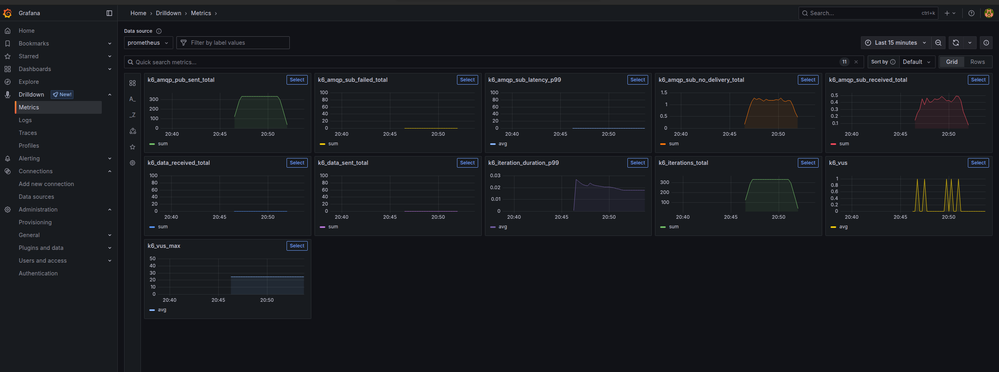
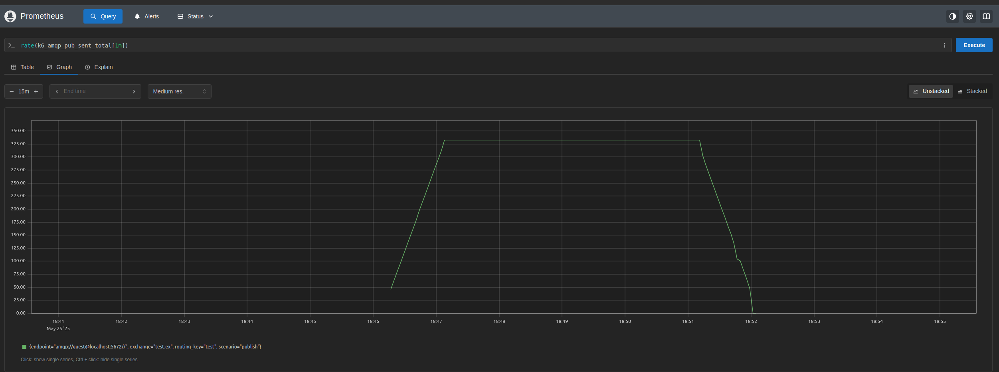
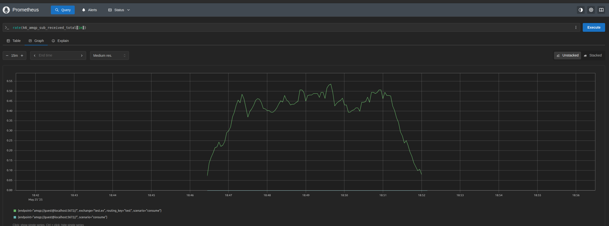

# K6 K9-AMQP extension prometheus remote write

## Summary

K6 allows to write K6 metrics using (prometheus-remote-write)[https://grafana.com/docs/k6/latest/results-output/real-time/prometheus-remote-write/#prometheus-remote-write] experimental module.


## Run Prometheus and Grafana

Use your Prometheus and Grafana or run locally.

### Create prometheus.yaml (empty file)


```yaml

```

### Create empty `data` directory


```sh
mkdir data

```

### Create docker-compose.yaml

```yaml
networks:
  prometheus:
    driver: bridge
  rabbitmq:
    driver: bridge

services:
  grafana:
    container_name: grafana
    image: grafana/grafana:13.1.0
    hostname: grafana
    ports:
      - "3000:3000"
    networks:
      - prometheus
  prometheus:
    container_name: prometheus
    image: prom/prometheus:v3.13.1
    hostname: prometheus
    ports:
      - "9090:9090"
    networks:
      - prometheus
    volumes:
      - type: bind
        source: ./prometheus.yaml
        target: /prometheus/prometheus.yaml
      - type: bind
        source: ./data/prometheus
        target: /test
    command: "--config.file=prometheus.yaml --storage.tsdb.retention.time=60d --web.enable-remote-write-receiver"
  rabbitmq:
    container_name: rabbitmq
    image: rabbitmq:4.3.2-management-alpine
    hostname: rabbitmq
    ports:
      - "5672:5672"
      - "15672:15672"
    networks:
      - rabbitmq
```

### Run Grafana and Prometheus


```sh
sudo docker compose up
```

```sh
[+] up 3/3
 ✔ Container rabbitmq   Created                                                                                                                                                                                                                                                              0.1s
 ✔ Container grafana    Created                                                                                                                                                                                                                                                              0.1s
 ✔ Container prometheus Created                                                                                                                                                                                                                                                              0.1s
Attaching to grafana, prometheus, rabbitmq
prometheus  | time=2026-07-12T09:59:06.079Z level=ERROR source=main.go:745 msg="Error loading config (--config.file=prometheus.yaml)" file=/prometheus/prometheus.yaml err="read prometheus.yaml: is a directory"
prometheus exited with code 2
rabbitmq    | 2026-07-12 09:59:06.315977+00:00 [warning] <0.144.0> Available file handles: 1024. Please consider increasing system limits
grafana     | logger=settings t=2026-07-12T09:59:06.40139224Z level=info msg="Starting Grafana" version=13.1.0 commit=b309c9bb3b81a748c3a75289236a27309ed2566a branch=release-13.1.0#patched compiled=2026-06-23T07:16:42Z
grafana     | logger=settings t=2026-07-12T09:59:06.402593274Z level=info msg="Unified migration configs enforced" storage_type=unified target=[all]
grafana     | logger=settings t=2026-07-12T09:59:06.402614153Z level=info msg="Enforcing mode 5 for resource in unified storage" resource=playlists.playlist.grafana.app
grafana     | logger=settings t=2026-07-12T09:59:06.402617539Z level=info msg="Enforcing mode 5 for resource in unified storage" resource=folders.folder.grafana.app
grafana     | logger=settings t=2026-07-12T09:59:06.402621447Z level=info msg="Enforcing mode 5 for resource in unified storage" resource=dashboards.dashboard.grafana.app
grafana     | logger=settings t=2026-07-12T09:59:06.402786256Z level=info msg="Config loaded from" file=/usr/share/grafana/conf/defaults.ini
grafana     | logger=settings t=2026-07-12T09:59:06.402789893Z level=info msg="Config loaded from" file=/etc/grafana/grafana.ini
grafana     | logger=settings t=2026-07-12T09:59:06.402792498Z level=info msg="Config overridden from command line" arg="default.paths.data=/var/lib/grafana"
grafana     | logger=settings t=2026-07-12T09:59:06.402795062Z level=info msg="Config overridden from command line" arg="default.paths.logs=/var/log/grafana"
grafana     | logger=settings t=2026-07-12T09:59:06.402797307Z level=info msg="Config overridden from command line" arg="default.paths.plugins=/var/lib/grafana/plugins"
grafana     | logger=settings t=2026-07-12T09:59:06.402799711Z level=info msg="Config overridden from command line" arg="default.paths.provisioning=/etc/grafana/provisioning"
grafana     | logger=settings t=2026-07-12T09:59:06.402802126Z level=info msg="Config overridden from command line" arg="default.log.mode=console"
grafana     | logger=settings t=2026-07-12T09:59:06.402805452Z level=info msg="Config overridden from Environment variable" var="GF_PATHS_DATA=/var/lib/grafana"
grafana     | logger=settings t=2026-07-12T09:59:06.402808508Z level=info msg="Config overridden from Environment variable" var="GF_PATHS_LOGS=/var/log/grafana"
grafana     | logger=settings t=2026-07-12T09:59:06.402810922Z level=info msg="Config overridden from Environment variable" var="GF_PATHS_PLUGINS=/var/lib/grafana/plugins"
grafana     | logger=settings t=2026-07-12T09:59:06.402813347Z level=info msg="Config overridden from Environment variable" var="GF_PATHS_PROVISIONING=/etc/grafana/provisioning"
grafana     | logger=settings t=2026-07-12T09:59:06.402816963Z level=info msg="Config overridden from Environment variable" var="GF_PATHS_HOME=/usr/share/grafana"
grafana     | logger=settings t=2026-07-12T09:59:06.402819358Z level=info msg="Config overridden from Environment variable" var="GF_PATHS_CONFIG=/etc/grafana/grafana.ini"
grafana     | logger=settings t=2026-07-12T09:59:06.402821662Z level=info msg=Target target=[all]
grafana     | logger=settings t=2026-07-12T09:59:06.402825439Z level=info msg="Path Home" path=/usr/share/grafana
grafana     | logger=settings t=2026-07-12T09:59:06.4028846Z level=info msg="Path Data" path=/var/lib/grafana
grafana     | logger=settings t=2026-07-12T09:59:06.402944423Z level=info msg="Path Logs" path=/var/log/grafana
grafana     | logger=settings t=2026-07-12T09:59:06.402947629Z level=info msg="Path Plugins" path="[/var/lib/grafana/plugins /usr/share/grafana/data/plugins-bundled]"
grafana     | logger=settings t=2026-07-12T09:59:06.402966654Z level=info msg="Path Provisioning" path=/etc/grafana/provisioning
grafana     | logger=settings t=2026-07-12T09:59:06.40296967Z level=info msg="App mode production"
grafana     | logger=featuremgmt t=2026-07-12T09:59:06.405939252Z level=info msg=FeatureToggles alertRuleRestore=true alertingBulkActionsInUI=true alertingImportYAMLUI=true alertingListViewV2=true alertingMigrationUI=true alertingMultiplePolicies=true alertingNavigationV2=true alertingNotificationsStepMode=true alertingQueryAndExpressionsStepMode=true alertingRulePermanentlyDelete=true alertingRuleRecoverDeleted=true alertingRuleVersionHistoryRestore=true alertingSaveStateCompressed=true alertingUIOptimizeReducer=true alertingUIUseBackendFilters=true alertingUIUseFullyCompatBackendFilters=true alertingUseNewSimplifiedRoutingHashAlgorithm=true annotationPermissionUpdate=true annotationsClustering=true awsAsyncQueryCaching=true awsDatasourcesTempCredentials=true azureMonitorEnableUserAuth=true azureMonitorPrometheusExemplars=true azureResourcePickerUpdates=true clearPreviousFieldValues=true cloudWatchCrossAccountQuerying=true cloudWatchNewLabelParsing=true cloudWatchRoundUpEndTime=true dashboardDefaultLayoutSelector=true dashboardNewLayouts=true dashboardSectionVariables=true dashboardUnifiedDrilldownControls=true enableSCIM=true feedbackButton=true grafana.scenesFlickeringFix=true grafanaAdvisor=true grafanaAssistantInProfilesDrilldown=true heatmapRowsAxisOptions=true improvedExternalSessionHandling=true improvedExternalSessionHandlingSAML=true influxdbBackendMigration=true kubernetesShortURLs=true lokiLabelNamesQueryApi=true lokiQuerySplitting=true multiPropsVariables=true newClickhouseConfigPageDesign=true newLogContext=true newLogsPanel=true newUnconfiguredPanel=true onlyStoreActionSets=true panelStyleActions=true profilesExemplars=true prometheusAzureOverrideAudience=true prometheusTypeMigration=true provisioning=true provisioning.readmes=true provisioningFolderMetadata=true pyroscopeUTF8LabelNames=true react19=true rememberUserOrgForSso=true renderAuthJWT=true restrictedPluginApis=true sqlExpressions=true teamFolders=true useKubernetesShortURLsAPI=true useMultipleScopeNodesEndpoint=true useScopeSingleNodeEndpoint=true useSessionStorageForRedirection=true vizLegendFacetedFilter=true vizPresets=true
grafana     | logger=sqlstore t=2026-07-12T09:59:06.406027437Z level=info msg="Connecting to DB" dbtype=sqlite3
grafana     | logger=sqlstore t=2026-07-12T09:59:06.406042385Z level=info msg="Using SQLite driver" driver=modernc.org/sqlite
grafana     | logger=sqlstore t=2026-07-12T09:59:06.406061531Z level=info msg="Creating SQLite database file" path=/var/lib/grafana/grafana.db
grafana     | logger=migrator t=2026-07-12T09:59:06.410168276Z level=info msg="Locking database"
grafana     | logger=migrator t=2026-07-12T09:59:06.410183885Z level=info msg="Starting DB migrations"
grafana     | logger=migrator t=2026-07-12T09:59:06.41094356Z level=info msg="Executing migration" id="create migration_log table"
grafana     | logger=migrator t=2026-07-12T09:59:06.411271185Z level=info msg="Migration successfully executed" id="create migration_log table" duration=327.334µs
grafana     | logger=migrator t=2026-07-12T09:59:06.414324063Z level=info msg="Executing migration" id="create user table"
grafana     | logger=migrator t=2026-07-12T09:59:06.414637431Z level=info msg="Migration successfully executed" id="create user table" duration=313.237µs
grafana     | logger=migrator t=2026-07-12T09:59:06.417146588Z level=info msg="Executing migration" id="add unique index user.login"
grafana     | logger=migrator t=2026-07-12T09:59:06.417429259Z level=info msg="Migration successfully executed" id="add unique index user.login" duration=282.73µs
grafana     | logger=migrator t=2026-07-12T09:59:06.41980201Z level=info msg="Executing migration" id="add unique index user.email"
grafana     | logger=migrator t=2026-07-12T09:59:06.420058742Z level=info msg="Migration successfully executed" id="add unique index user.email" duration=264.016µs
grafana     | logger=migrator t=2026-07-12T09:59:06.422552952Z level=info msg="Executing migration" id="drop index UQE_user_login - v1"
grafana     | logger=migrator t=2026-07-12T09:59:06.422869475Z level=info msg="Migration successfully executed" id="drop index UQE_user_login - v1" duration=318.197µs
grafana     | logger=migrator t=2026-07-12T09:59:06.425243459Z level=info msg="Executing migration" id="drop index UQE_user_email - v1"
grafana     | logger=migrator t=2026-07-12T09:59:06.425496284Z level=info msg="Migration successfully executed" id="drop index UQE_user_email - v1" duration=253.145µs
grafana     | logger=migrator t=2026-07-12T09:59:06.428082015Z level=info msg="Executing migration" id="Rename table user to user_v1 - v1"
grafana     | logger=migrator t=2026-07-12T09:59:06.429160679Z level=info msg="Migration successfully executed" id="Rename table user to user_v1 - v1" duration=1.077461ms
grafana     | logger=migrator t=2026-07-12T09:59:06.431531828Z level=info msg="Executing migration" id="create user table v2"
...
```

### Check Prometheus, Grafana and RabbitMQ are up

[Local Prometheus](http://localhost:9090)
[Local Grafana](http://localhost:9090)
[Local RabbitMQ](http://localhost:15672/)

### Add Prometheus Data Source to grafana

[Add Data Source](http://localhost:3000/connections/datasources/new)

Use `http://prometheus:9090` URL as Prometheus Server URL and `Save & test`

### Check Grafana Metrics

[Grafana Metrics](http://localhost:3000/a/grafana-metricsdrilldown-app/drilldown)

### Run K6 Test

Run K6 test using `K6_PROMETHEUS_RW_SERVER_URL` environment variable.


```sh
K6_PROMETHEUS_RW_SERVER_URL=http://localhost:9090/api/v1/write k6 run -o experimental-prometheus-rw ./examples/produce-consume.js
```

```sh
INFO[0000] 2026/07/12 12:06:45 INFO init amqp client with pool {ChannelsPerConn:1 ChannelsCacheSize:20}

         /\      Grafana   /‾‾/
    /\  /  \     |\  __   /  /  
   /  \/    \    | |/ /  /   ‾‾\
  /          \   |   (  |  (‾)  |
 / __________ \  |_|\_\  \_____/


     execution: local
        script: ./examples/produce-consume.js
        output: Prometheus remote write (http://localhost:9090/api/v1/write)

     scenarios: (100.00%) 2 scenarios, 50 max VUs, 1m40s max duration (incl. graceful stop):
              * publish: 333.33 iterations/s for 1m0s (maxVUs: 20-40, exec: produce, gracefulStop: 30s)
              * consume: 1.67 iterations/s for 1m0s (maxVUs: 5-10, exec: consume, startTime: 10s, gracefulStop: 30s)

INFO[0000] 2026/07/12 12:06:45 INFO no available channel in pool, creating new one
INFO[0000] 2026/07/12 12:06:45 INFO exchange created name=test.ex
INFO[0000] 2026/07/12 12:06:45 INFO queue created name=test.q
INFO[0000] 2026/07/12 12:06:45 INFO queue binded name=test.q key=test
INFO[0010] 2026/07/12 12:06:55 INFO no available channel in pool, creating new one
INFO[0070] 2026/07/12 12:07:55 INFO Teardown AMQP Client


  █ TOTAL RESULTS 

    CUSTOM
    amqp_pub_failed........: 0     0/s
    amqp_pub_sent..........: 20001 285.559672/s
    amqp_sub_failed........: 0     0/s
    amqp_sub_no_delivery...: 96    1.370618/s
    amqp_sub_received......: 4     0.057109/s

    EXECUTION
    iteration_duration.....: avg=137µs min=17.81µs med=85.69µs max=8.96ms p(90)=291.56µs p(95)=328.98µs
    iterations.............: 20101 286.987399/s
    vus....................: 0     min=0        max=1
    vus_max................: 25    min=25       max=25

    NETWORK
    data_received..........: 0 B   0 B/s
    data_sent..............: 0 B   0 B/s


running (1m10.0s), 00/25 VUs, 20101 complete and 0 interrupted iterations
publish ✓ [======================================] 00/20 VUs  1m0s  333.33 iters/s
consume ✓ [======================================] 00/05 VUs  1m0s  1.67 iters/s
```

### Check Promethues Metrics in Grafana





